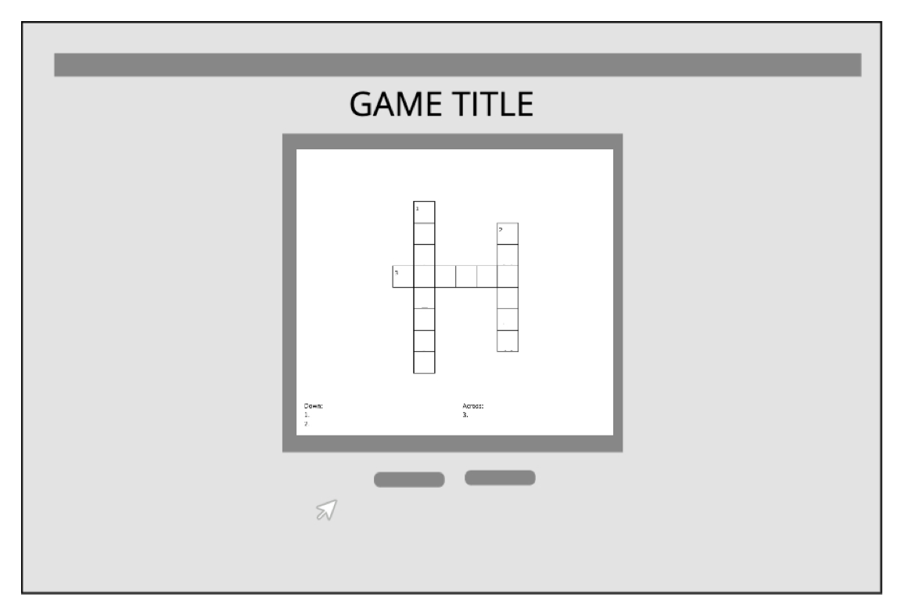

# Words-with-Friends - GAME PITCH [P L A Y  N O W](https://ndukadesign.github.io/words-with-friends/)

## What's the game about?

Welcome to Words-with-Friends! A new word a day helps the brain play. Let's see how many words you can solve before time runs out. Don't worry the hints will be sure to jog your memory.  Enjoy 😎.

## Tech stack

- Vanilla HTML, JS, and CSS
- HTML5 DOM

## Wireframes

## MVP Goals

- Create a cross word puzzle
- Reveal if answer is right/wrong
- Create button to submit answer
- Create a hint index
- A reset button

## Stretch Goals

- Play background music
- Add a timer
- Create a high score counter

## Potential Roadblocks

- Not getting to caught up in design aesthetics that I don't solve the game functionality
- Making this have a smooth movement pattern
- How to keep track of every right answer
